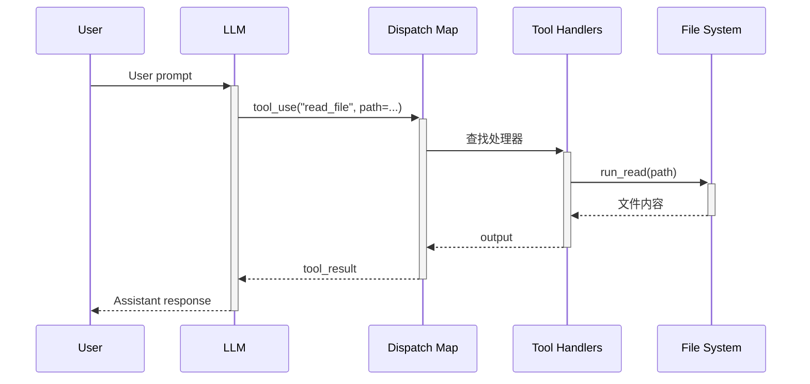

# S02 学习笔记：工具分发（Tool Dispatch）

## 2026-04-28

### S01 vs S02 核心区别

| 对比项 | S01 | S02 |
|--------|-----|-----|
| 工具数量 | 1 个（bash） | 4 个（bash, read_file, write_file, edit_file） |
| 工具执行 | 硬编码在循环中 | 通过 `TOOL_HANDLERS` 分发映射 |
| 安全检查 | 无 | `safe_path()` 防止目录遍历 |
| 代码结构 | 工具散落在各处 | 工具定义集中、处理器独立 |

### 关键洞察

> **"The loop didn't change at all. I just added tools."**

核心循环（`agent_loop`）完全没变，只是在 `TOOL_HANDLERS` 字典里添加新条目。

### 新增内容

#### 1. 安全路径检查

```python
def safe_path(p: str) -> Path:
    path = (WORKDIR / p).resolve()
    if not path.is_relative_to(WORKDIR):
        raise ValueError(f"Path escapes workspace: {p}")
    return path
```

防止 agent 访问工作目录之外的文件（目录遍历攻击）。

#### 2. 新的工具处理器

| 函数 | 工具名 | 功能 |
|------|--------|------|
| `run_bash` | bash | 执行 shell 命令 |
| `run_read` | read_file | 读取文件内容 |
| `run_write` | write_file | 写入文件 |
| `run_edit` | edit_file | 替换文件中的文本 |

#### 3. TOOL_HANDLERS 分发映射

```python
TOOL_HANDLERS = {
    "bash":       lambda **kw: run_bash(kw["command"]),
    "read_file":  lambda **kw: run_read(kw["path"], kw.get("limit")),
    "write_file": lambda **kw: run_write(kw["path"], kw["content"]),
    "edit_file":  lambda **kw: run_edit(kw["path"], kw["old_text"], kw["new_text"]),
}
```

**执行流程**：
```python
handler = TOOL_HANDLERS.get(block.name)
output = handler(**block.input) if handler else f"Unknown tool: {block.name}"
```

### 时序图



### 详细执行流程

```
User: "读取 s01_agent_loop.py"
       │
       ▼
┌─────────────────────────────────────────────────────────────┐
│ agent_loop()                                                │
│   1. client.messages.create(model, messages, tools)        │
│   2. messages.append(assistant)                            │
│   3. if stop_reason != "tool_use": return                  │
│   4. for block in response.content:                        │
│      - handler = TOOL_HANDLERS.get("read_file")           │
│      - output = handler(path="s01_agent_loop.py")         │
│   5. messages.append(user: results)                        │
└─────────────────────────────────────────────────────────────┘
       │
       ▼
┌─────────────────────────────────────────────────────────────┐
│ TOOL_HANDLERS["read_file"]                                  │
│   lambda **kw: run_read(kw["path"], kw.get("limit"))       │
│       │                                                     │
│       ▼                                                     │
│ run_read(path="s01_agent_loop.py")                         │
│   1. safe_path(path) → 检查路径安全性                       │
│   2. text = path.read_text() → 读取文件内容                 │
│   3. return text[:50000] → 截断返回                        │
└─────────────────────────────────────────────────────────────┘
```

### 工具 schema 定义

```python
TOOLS = [
    {"name": "bash", "description": "Run a shell command.",
     "input_schema": {"type": "object", "properties": {"command": {"type": "string"}}, "required": ["command"]}},
    {"name": "read_file", "description": "Read file contents.",
     "input_schema": {"type": "object", "properties": {"path": {"type": "string"}, "limit": {"type": "integer"}}, "required": ["path"]}},
    {"name": "write_file", "description": "Write content to file.",
     "input_schema": {"type": "object", "properties": {"path": {"type": "string"}, "content": {"type": "string"}}, "required": ["path", "content"]}},
    {"name": "edit_file", "description": "Replace exact text in file.",
     "input_schema": {"type": "object", "properties": {"path": {"type": "string"}, "old_text": {"type": "string"}, "new_text": {"type": "string"}}, "required": ["path", "old_text", "new_text"]}},
]
```

### 核心模式（不变）

```python
def agent_loop(messages: list):
    while True:
        response = client.messages.create(
            model=MODEL, system=SYSTEM, messages=messages,
            tools=TOOLS, max_tokens=8000,
        )
        messages.append({"role": "assistant", "content": response.content})
        if response.stop_reason != "tool_use":
            return
        results = []
        for block in response.content:
            if block.type == "tool_use":
                handler = TOOL_HANDLERS.get(block.name)
                output = handler(**block.input) if handler else f"Unknown tool: {block.name}"
                results.append({"type": "tool_result", "tool_use_id": block.id, "content": output})
        messages.append({"role": "user", "content": results})
```

### 扩展工具的方法

只需在两个地方添加：

1. **TOOL_HANDLERS** 添加一行：
```python
TOOL_HANDLERS = {
    # ... 现有工具 ...
    "new_tool": lambda **kw: run_new_tool(kw["param"]),
}
```

2. **TOOLS** 数组添加一个工具定义：
```python
TOOLS.append({
    "name": "new_tool",
    "description": "Description here",
    "input_schema": {...}
})
```

**循环不变，扩展极其简单。**

### 文件清单

- `s01_agent_loop.py` - 基础循环（单工具）
- `s02_tool_use.py` - 工具分发（多工具）
- `学习笔记_S01_环境配置.md` - 环境配置

---

## Python 语法疑问解答

### 1. `lambda **kw` 中的 kw 是什么意思？

`**kw` 是关键字参数收集（keyword arguments），会把传入的所有关键字参数打包成字典。

```python
lambda **kw: run_bash(kw["command"])
```

当调用 `handler(command="pwd")` 时，`kw` 收到 `{"command": "pwd"}`，然后 `kw["command"]` 取出值。

### 2. `def run_bash(command: str) -> str:` 是什么意思？

| 符号 | 含义 |
|------|------|
| `def` | 关键字，定义函数 |
| `run_bash` | 函数名 |
| `command: str` | 参数 `command` 类型是 `str` |
| `-> str` | 返回值类型是 `str` |

含义：定义一个函数 `run_bash`，接收字符串参数，返回字符串。

### 3. `return out[:50000] if out else "(no output)"` 是什么意思？

三元表达式，if 简写形式：

```python
# 等价于
if out:
    return out[:50000]
else:
    return "(no output)"
```

### 4. `print(f"> {block.name}")` 是什么意思？

f-string 格式化字符串，`{block.name}` 会被替换成变量的值：

```python
block.name = "bash"
print(f"> {block.name}")  # 输出: > bash
```