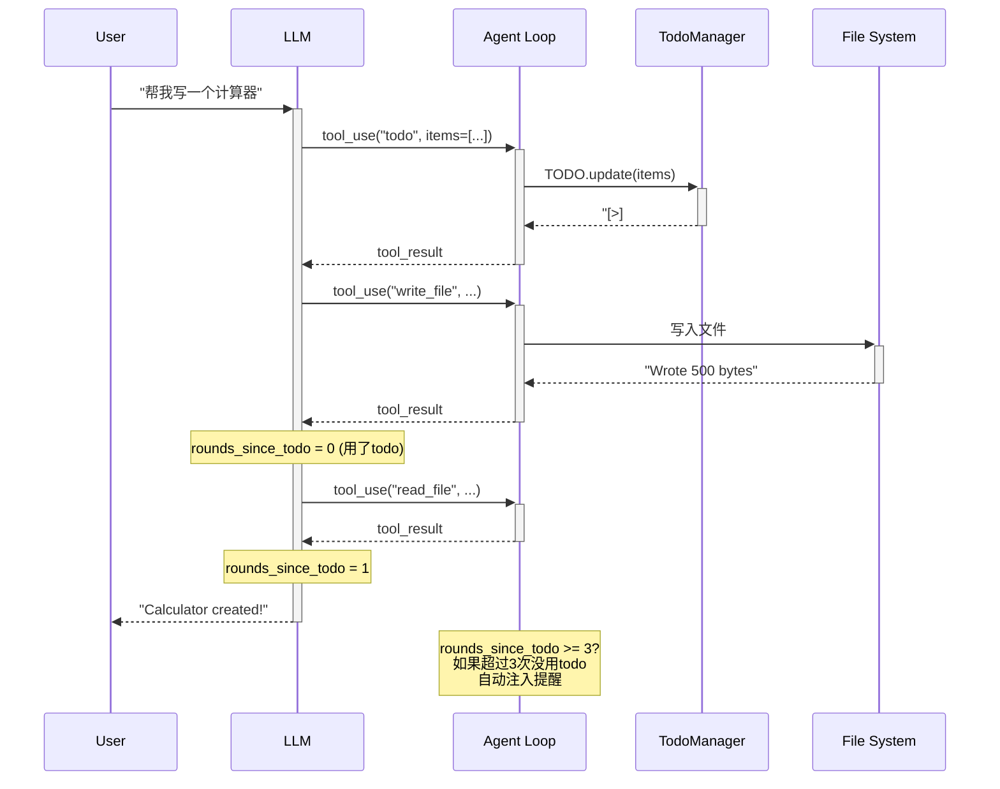

# S03 学习笔记：计划优先执行（TodoWrite）

## 2026-04-28

### S01 vs S02 vs S03 核心区别

| 对比项 | S01 | S02 | S03 |
|--------|-----|-----|-----|
| 工具数量 | 1 个 | 4 个 | 5 个（+ todo） |
| 工具执行 | 硬编码 | 分发映射 | 分发映射 |
| 状态管理 | 无 | 无 | **TodoManager** |
| 提醒机制 | 无 | 无 | **Nag reminder** |
| 安全检查 | 无 | safe_path() | safe_path() |

### 关键洞察

> **"The agent can track its own progress -- and I can see it."**

S03 的核心创新：让 Agent 自己管理任务进度，而不是脚本预设路线。

### S03 新增内容

#### 1. TodoManager 类

```python
class TodoManager:
    def __init__(self):
        self.items = []

    def update(self, items: list) -> str:
        # 验证：最多 20 个、状态合法、只能有 1 个 in_progress
        ...
        return self.render()

    def render(self) -> str:
        # 渲染成可读文本
        # [ ] #1: 任务 A
        # [>] #2: 任务 B <- 正在做
        # [x] #3: 任务 C
```

**Todo 状态**：
- `pending` — 待做 `[ ]`
- `in_progress` — 正在进行 `[>]`
- `completed` — 已完成 `[x]`

#### 2. todo 工具

```python
TOOL_HANDLERS = {
    # ... 其他工具 ...
    "todo": lambda **kw: TODO.update(kw["items"]),
}

TOOLS.append({
    "name": "todo",
    "description": "Update task list. Track progress on multi-step tasks.",
    "input_schema": {"type": "object", "properties": {"items": {...}}, "required": ["items"]},
})
```

#### 3. Nag Reminder（唠叨提醒）

```python
def agent_loop(messages: list):
    rounds_since_todo = 0
    while True:
        # ... 执行工具 ...
        used_todo = False
        for block in response.content:
            if block.name == "todo":
                used_todo = True
        rounds_since_todo = 0 if used_todo else rounds_since_todo + 1
        if rounds_since_todo >= 3:
            results.append({"type": "text", "text": "<reminder>Update your todos.</reminder>"})
```

**机制**：
- 如果连续 3 轮没有更新 todo，自动注入提醒
- 强制 Agent 保持任务跟踪

### 时序图



### Agent Loop 对比

**S01/S02 的 agent_loop**：
```python
def agent_loop(messages: list):
    while True:
        response = client.messages.create(...)
        messages.append({"role": "assistant", "content": response.content})
        if response.stop_reason != "tool_use":
            return
        results = []
        for block in response.content:
            if block.type == "tool_use":
                output = TOOL_HANDLERS[block.name](**block.input)
                results.append({"type": "tool_result", ...})
        messages.append({"role": "user", "content": results})
```

**S03 的 agent_loop（新增 nag reminder）**：
```python
def agent_loop(messages: list):
    rounds_since_todo = 0
    while True:
        response = client.messages.create(...)
        messages.append({"role": "assistant", "content": response.content})
        if response.stop_reason != "tool_use":
            return
        results = []
        used_todo = False
        for block in response.content:
            if block.type == "tool_use":
                output = TOOL_HANDLERS[block.name](**block.input)
                results.append({"type": "tool_result", ...})
                if block.name == "todo":
                    used_todo = True
        # 新增：nag reminder 逻辑
        rounds_since_todo = 0 if used_todo else rounds_since_todo + 1
        if rounds_since_todo >= 3:
            results.append({"type": "text", "text": "<reminder>Update your todos.</reminder>"})
        messages.append({"role": "user", "content": results})
```

### TodoManager 验证规则

```python
def update(self, items: list) -> str:
    # 规则 1：最多 20 个 todo
    if len(items) > 20:
        raise ValueError("Max 20 todos allowed")

    # 规则 2：每个 item 必须有 text
    if not text:
        raise ValueError(f"Item {item_id}: text required")

    # 规则 3：状态必须是 pending/in_progress/completed
    if status not in ("pending", "in_progress", "completed"):
        raise ValueError(f"Item {item_id}: invalid status '{status}'")

    # 规则 4：只能有 1 个 in_progress
    if in_progress_count > 1:
        raise ValueError("Only one task can be in_progress at a time")
```

### 核心模式（不变）

```
messages.create(model, messages, tools)
                      ↓
              stop_reason == "tool_use"?
                      ↓
              执行 TOOL_HANDLERS[block.name]
                      ↓
              收集 tool_results
                      ↓
              rounds >= 3? → 注入 <reminder>
                      ↓
              回到 LLM
```

### 文件清单

- `s01_agent_loop.py` - 基础循环（单工具）
- `s02_tool_use.py` - 工具分发（多工具）
- `s03_todo_write.py` - 计划优先（+ Todo + Nag Reminder）
- `学习笔记_S01_环境配置.md` - 环境配置
- `学习笔记_S02_工具分发.md` - 工具分发

---

## Python 语法补充

### `class TodoManager:` 中的 `self.items = []`

| 部分 | 含义 |
|------|------|
| `class` | 关键字，定义类 |
| `TodoManager` | 类名 |
| `def __init__(self):` | 构造函数，创建对象时自动调用 |
| `self` | 指对象本身，类似于 "我" |
| `self.items = []` | 给对象添加一个属性 `items`，初始为空列表 |

### `enumerate(items)` 的 enumerate 作用

```python
for i, item in enumerate(items):
    # i 是索引（0, 1, 2, ...）
    # item 是元素值
```

| 调用 | 结果 |
|------|------|
| `enumerate(["a", "b", "c"])` | `[(0, "a"), (1, "b"), (2, "c")]` |

### `item.get("text", "")` vs `item["text"]`

| 方式 | 行为 |
|------|------|
| `item["text"]` | 如果不存在，报错 KeyError |
| `item.get("text", "")` | 如果不存在，返回默认值 `""` |

### `sum(1 for t in self.items if t["status"] == "completed")`

生成器表达式，统计完成的任务数：

```python
# 等价于
count = 0
for t in self.items:
    if t["status"] == "completed":
        count += 1
```

### `f"\n({done}/{len(self.items)} completed)"`

f-string 格式化，多行字符串拼接：

```python
done = 2
total = 5
f"\n({done}/{total} completed)"
# 结果: "\n(2/5 completed)"
```