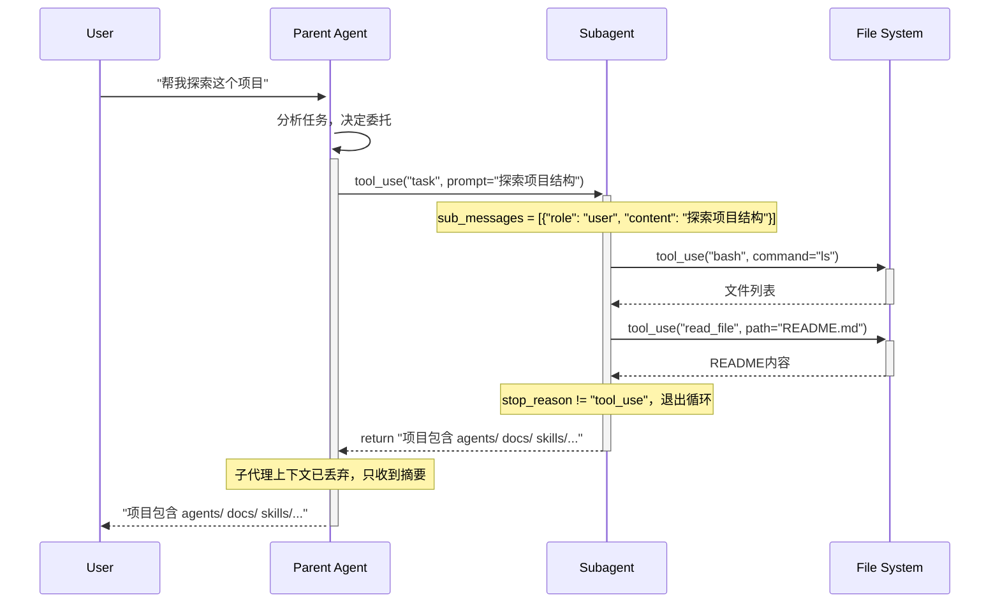

# S04 学习笔记：子代理（Subagents）

## 2026-04-28

### S01 vs S02 vs S03 vs S04 核心区别

| 对比项 | S01 | S02 | S03 | S04 |
|--------|-----|-----|-----|-----|
| 工具数量 | 1 个 | 4 个 | 5 个 | 5 个（+ task） |
| 状态管理 | 无 | 无 | TodoManager | 无 |
| 提醒机制 | 无 | 无 | Nag reminder | 无 |
| 子代理 | 无 | 无 | 无 | **run_subagent()** |
| 上下文 | 共享 | 共享 | 共享 | **独立 fresh messages[]** |

### 关键洞察

> **"Process isolation gives context isolation for free."**

子代理拥有独立的 `messages=[]`，共享文件系统，但对话历史不泄漏。

### S04 核心创新

#### 1. 子代理独立上下文

```python
def run_subagent(prompt: str) -> str:
    sub_messages = [{"role": "user", "content": prompt}]  # fresh context!
    for _ in range(30):  # safety limit
        response = client.messages.create(
            model=MODEL, system=SUBAGENT_SYSTEM, messages=sub_messages,
            tools=CHILD_TOOLS, max_tokens=8000,
        )
        sub_messages.append({"role": "assistant", "content": response.content})
        if response.stop_reason != "tool_use":
            break
        # 执行工具...
    # 只返回摘要，子代理上下文被丢弃
    return "".join(b.text for b in response.content if hasattr(b, "text"))
```

**关键点**：
- `sub_messages = [{"role": "user", "content": prompt}]` — 全新空上下文
- 子代理最多执行 30 轮（安全限制）
- 只返回最后一个文本响应，完整上下文被丢弃

#### 2. task 工具（分发子代理）

```python
PARENT_TOOLS = CHILD_TOOLS + [
    {"name": "task", "description": "Spawn a subagent with fresh context.",
     "input_schema": {"type": "object", "properties": {
         "prompt": {"type": "string"},
         "description": {"type": "string"}
     }, "required": ["prompt"]}},
]

def agent_loop(messages: list):
    for block in response.content:
        if block.type == "tool_use":
            if block.name == "task":
                output = run_subagent(prompt)
            else:
                handler = TOOL_HANDLERS.get(block.name)
                output = handler(**block.input)
```

#### 3. 两套工具

```python
CHILD_TOOLS = [bash, read_file, write_file, edit_file]  # 子代理可用
PARENT_TOOLS = CHILD_TOOLS + [task]  # 父代理额外多了 task
```

**子代理不能递归派生** — `task` 工具不在 `CHILD_TOOLS` 中。

### 时序图



### 执行流程对比

**S01-S03：单代理循环**
```
messages → LLM → 工具 → 结果 → messages（继续累积）
```

**S04：父代理 + 子代理**
```
父: messages → LLM → task工具 → run_subagent()
                                    ↓
                              sub_messages=[]（独立）
                                    ↓
                              LLM → 工具 → 结果
                                    ↓
                              return 摘要 → 父messages
```

### 关键代码解析

#### `sub_messages = [{"role": "user", "content": prompt}]`

创建全新的消息列表，子代理从干净的上下文开始。

#### `for _ in range(30):`

安全限制，防止子代理无限循环。`_` 表示不使用的循环变量。

#### `return "".join(b.text for b in response.content if hasattr(b, "text"))`

提取响应中的所有文本块并拼接：

```python
# 等价于
texts = []
for b in response.content:
    if hasattr(b, "text"):
        texts.append(b.text)
return "".join(texts)
```

#### `PARENT_TOOLS = CHILD_TOOLS + [task]`

合并列表，父代理拥有所有子代理工具 + task 工具。

### 核心模式

```
Parent Agent:
    messages=[用户历史...]
         ↓
    LLM 决定调用 task 工具
         ↓
    run_subagent(prompt) ← 传入子任务
         ↓
Subagent:
    sub_messages=[{"role": "user", "content": prompt}] ← 干净上下文
         ↓
    独立循环（最多30轮）
         ↓
    return 摘要（丢弃完整上下文）
         ↓
Parent Agent:
    把摘要加入 results，继续自己的循环
```

### 文件清单

- `s01_agent_loop.py` - 基础循环（单工具）
- `s02_tool_use.py` - 工具分发（多工具）
- `s03_todo_write.py` - 计划优先（+ Todo + Nag Reminder）
- `s04_subagent.py` - 子代理（独立上下文 + 摘要返回）
- `学习笔记_S01_环境配置.md` - 环境配置
- `学习笔记_S02_工具分发.md` - 工具分发
- `学习笔记_S03_计划优先.md` - 计划优先

---

## Python 语法补充

### `for _ in range(30):` 中的 `_`

`_` 是 Python 的惯例用法，表示"不使用的变量"：

```python
# 不需要用到循环变量时
for _ in range(30):
    print("执行30次")

# 等价但更清晰
for i in range(30):
    print("执行30次")
    # i 没被使用
```

### `hasattr(b, "text")`

检查对象是否有某个属性：

```python
class TextBlock:
    def __init__(self, text):
        self.text = text

b = TextBlock("hello")

hasattr(b, "text")  # True
hasattr(b, "name")  # False
```

### `"".join(...)`

拼接字符串列表：

```python
"".join(["a", "b", "c"])      # "abc"
"-".join(["a", "b", "c"])     # "a-b-c"
"".join(b.text for b in list if hasattr(b, "text"))  # 拼接所有文本
```

### `PARENT_TOOLS = CHILD_TOOLS + [task]`

列表拼接：

```python
a = [1, 2, 3]
b = [4, 5]
a + b  # [1, 2, 3, 4, 5]
```

### `block.input.get("description", "subtask")`

字典 get 方法，获取值或默认值：

```python
d = {"prompt": "hello"}
d.get("description", "subtask")  # "subtask"（默认值）
d.get("prompt", "")               # "hello"
```