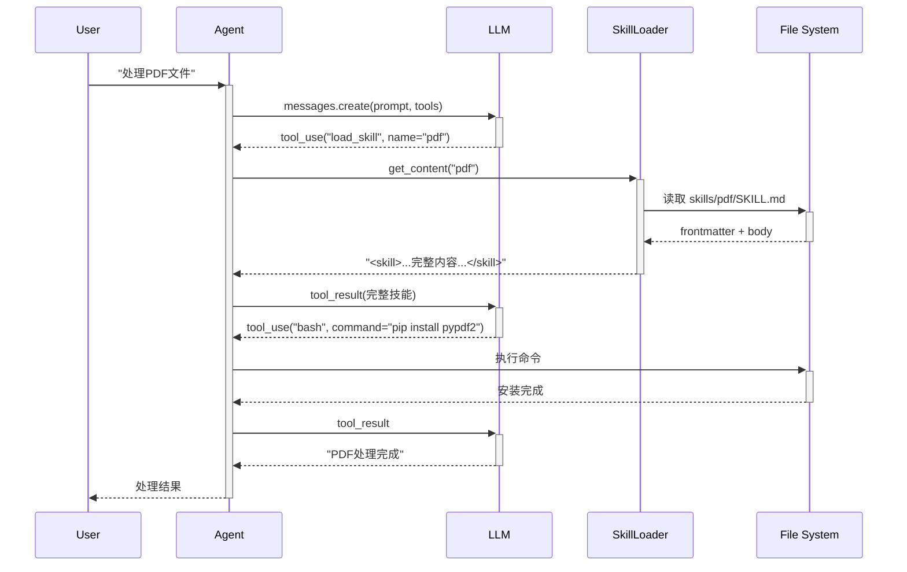

# S05 学习笔记：技能加载（Skill Loading）

## 2026-05-05

### S01 - S05 演进总结

| Session | 主题 | 核心机制 |
|---------|------|----------|
| S01 | Agent 循环 | while + stop_reason |
| S02 | 工具分发 | TOOL_HANDLERS 映射 |
| S03 | 计划优先 | TodoManager + Nag Reminder |
| S04 | 子代理 | 独立 messages[] + 摘要返回 |
| **S05** | **技能加载** | **两层注入：元数据 + 按需加载** |

### 关键洞察

> **"Don't put everything in the system prompt. Load on demand."**

不要把所有知识都塞进 system prompt，用两层机制按需加载。

### S05 核心创新：两层技能注入

#### Layer 1：系统提示词中的元数据（便宜）

```python
SYSTEM = f"""You are a coding agent at {WORKDIR}.
Use load_skill to access specialized knowledge before tackling unfamiliar topics.

Skills available:
{SKILL_LOADER.get_descriptions()}"""
```

输出示例：
```
Skills available:
  - pdf: Process PDF files [productivity]
  - code-review: Review code for bugs [devtools]
  - bash: Shell command reference [system]
```

**Token 消耗**：约 100 token/skill（极便宜）

#### Layer 2：tool_result 中的完整技能体（按需）

当 Agent 调用 `load_skill("pdf")` 时：

```python
TOOL_HANDLERS = {
    ...
    "load_skill": lambda **kw: SKILL_LOADER.get_content(kw["name"]),
}
```

返回：
```
<skill name="pdf">
  Step 1: Read PDF using pypdf2
  Step 2: Extract text with encoding detection
  Step 3: Handle multi-column layout
  ...
</skill>
```

这个 `<skill>` 标签会被注入到 `messages` 中，Agent 下次调用 LLM 时能读取完整技能说明。

### 时序图



### SkillLoader 类解析

```python
class SkillLoader:
    def __init__(self, skills_dir: Path):
        self.skills_dir = skills_dir
        self.skills = {}
        self._load_all()  # 启动时扫描所有 skills/

    def _load_all(self):
        if not self.skills_dir.exists():
            return
        for f in sorted(self.skills_dir.rglob("SKILL.md")):
            # rglob 递归搜索所有 SKILL.md
            text = f.read_text()
            meta, body = self._parse_frontmatter(text)
            name = meta.get("name", f.parent.name)
            self.skills[name] = {"meta": meta, "body": body, "path": str(f)}

    def _parse_frontmatter(self, text: str) -> tuple:
        """解析 YAML frontmatter"""
        match = re.match(r"^---\n(.*?)\n---\n(.*)", text, re.DOTALL)
        if not match:
            return {}, text
        try:
            meta = yaml.safe_load(match.group(1)) or {}
        except yaml.YAMLError:
            meta = {}
        return meta, match.group(2).strip()
```

### SKILL.md 文件格式

```yaml
---
name: pdf
description: Process PDF files efficiently
tags: productivity, document
---

# PDF Processing Skill

## Step 1: Install dependencies
```bash
pip install pypdf2
```

## Step 2: Read PDF
```python
from pypdf import Reader
reader = Reader("file.pdf")
```

## Step 3: Extract text
...
```

**解析逻辑**：
1. `---` 之间的内容是 YAML 元数据
2. `---` 之后的内容是技能主体（body）
3. `name` 和 `description` 用于 Layer 1 显示

### 对比：塞满 System Prompt vs 按需加载

**传统方式（System Prompt 塞满）**：
```
System: "你是一个 coding agent... 另外你还需要知道 PDF 处理：Step1...Step2...Step3..."
```
- 问题：每次都加载全部内容，token 浪费
- 问题：system prompt 有长度限制

**S05 方式（按需加载）**：
```
System: "技能: pdf, code-review, bash" (仅元数据)

[当需要时]
Tool: load_skill("pdf") → 返回完整技能
```
- 优势：system prompt 保持精简
- 优势：只加载需要的技能

### 文件结构

```
WORKDIR/
├── agents/
│   └── s05_skill_loading.py
└── skills/
    ├── pdf/
    │   └── SKILL.md         ← YAML frontmatter + body
    ├── code-review/
    │   └── SKILL.md
    └── bash/
        └── SKILL.md
```

### 核心模式

```
System prompt:
  "Skills available:" + SKILL_LOADER.get_descriptions()
                          ↓
                    Layer 1: 仅元数据

Agent 调用 load_skill("pdf"):
  SKILL_LOADER.get_content("pdf")
                          ↓
                    Layer 2: 完整技能体
                          ↓
                    <skill name="pdf">...</skill>
                          ↓
                    注入到 messages
                          ↓
                    下次 LLM 调用时读取完整内容
```

### 文件清单

- `s01_agent_loop.py` - 基础循环
- `s02_tool_use.py` - 工具分发
- `s03_todo_write.py` - 计划优先
- `s04_subagent.py` - 子代理
- `s05_skill_loading.py` - 技能加载（两层注入）
- `skills/` - 技能文件目录
- `学习笔记_S01-S04.md` - 前期笔记

---

## Python 语法补充

### `rglob("SKILL.md")`

递归 glob，用于搜索所有子目录中的文件：

```python
# 普通 glob
Path("skills").glob("**/*.md")  # 等价

# rglob 是 recursive glob
for f in Path("skills").rglob("SKILL.md"):
    print(f)
    # skills/pdf/SKILL.md
    # skills/code-review/SKILL.md
    # skills/bash/SKILL.md
```

### `re.match(r"^---\n(.*?)\n---\n(.*)", text, re.DOTALL)`

正则表达式解析 YAML frontmatter：

| 模式 | 含义 |
|------|------|
| `^---` | 行首的 `---` |
| `\n` | 换行 |
| `(.*?)` | 非贪婪匹配任意字符（捕获组 1：meta） |
| `\n---` | 换行 + `---` |
| `(.*)` | 贪婪匹配剩余内容（捕获组 2：body） |
| `re.DOTALL` | `.` 匹配换行符 |

```python
text = """---
name: pdf
description: Process PDF
---
# Body content
Step 1: ...
"""

match = re.match(r"^---\n(.*?)\n---\n(.*)", text, re.DOTALL)
meta = yaml.safe_load(match.group(1))  # {"name": "pdf", "description": "..."}
body = match.group(2)  # "# Body content\nStep 1: ..."
```

### `yaml.safe_load()`

安全解析 YAML 格式（防止代码注入）：

```python
import yaml

yaml_string = """
name: pdf
tags:
  - productivity
  - document
"""

data = yaml.safe_load(yaml_string)
# {'name': 'pdf', 'tags': ['productivity', 'document']}
```

### `self._load_all()` 中的下划线 `_`

下划线开头的方法表示"私有方法"（不应该外部调用）：

```python
class SkillLoader:
    def _load_all(self):  # 私有方法
        ...

    def get_content(self):  # 公开方法
        ...
```

### `sorted(self.skills_dir.rglob("SKILL.md"))`

对结果排序，保证加载顺序一致：

```python
list(sorted(Path("skills").rglob("SKILL.md")))
# [PosixPath('skills/bash/SKILL.md'),
#  PosixPath('skills/code-review/SKILL.md'),
#  PosixPath('skills/pdf/SKILL.md')]
```

### `f"<skill name=\"{name}\">\n{skill['body']}\n</skill>"`

字符串拼接，注意转义：

```python
name = "pdf"
body = "Step 1: ..."
f"<skill name=\"{name}\">\n{body}\n</skill>"
# <skill name="pdf">
# Step 1: ...
# </skill>
```