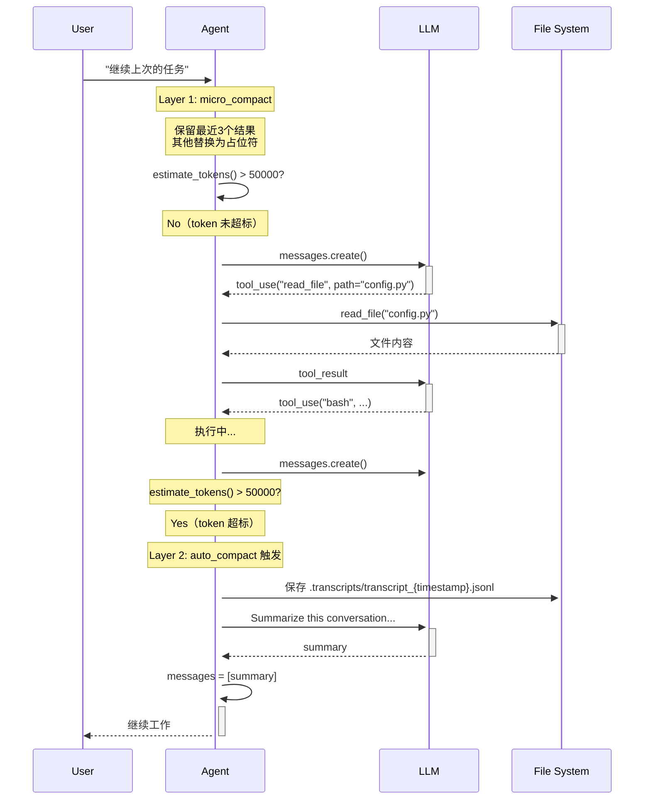

# S06 学习笔记：上下文压缩（Context Compact）

## 2026-05-05

### S01 - S06 演进总结

| Session | 主题 | 核心机制 |
|---------|------|----------|
| S01 | Agent 循环 | while + stop_reason |
| S02 | 工具分发 | TOOL_HANDLERS 映射 |
| S03 | 计划优先 | TodoManager + Nag Reminder |
| S04 | 子代理 | 独立 messages[] + 摘要返回 |
| S05 | 技能加载 | 两层注入：元数据 + 按需 |
| **S06** | **上下文压缩** | **三层压缩实现无限会话** |

### 关键洞察

> **"The agent can forget strategically and keep working forever."**

通过三层压缩策略，Agent 可以"战略性遗忘"，保持工作永远进行。

### S06 核心创新：三层压缩

#### Layer 1：micro_compact（每轮自动执行，静默）

**原理**：保留最近 3 个工具结果，将更早的非 read_file 结果替换为占位符。

```python
KEEP_RECENT = 3
PRESERVE_RESULT_TOOLS = {"read_file"}  # read_file 结果保留（参考材料）

# 示例
# 原来：tool_result: "apt install python3..." (500行)
# 压缩后：tool_result: "[Previous: used bash]"
```

**为什么保留 read_file？**
- read_file 是参考材料，压缩后 Agent 会被迫重新读取
- 保持上下文相关性

#### Layer 2：auto_compact（自动触发，超阈值时）

**触发条件**：`estimate_tokens(messages) > THRESHOLD`（50,000 tokens）

**流程**：

```
1. 保存完整记录到 .transcripts/
   transcript_{timestamp}.jsonl

2. 调用 LLM 总结对话
   - 完成了什么？
   - 当前状态？
   - 关键决策？

3. 用摘要替换所有消息
   [{"role": "user", "content": "[压缩说明]\n\n摘要内容"}]
```

#### Layer 3：compact 工具（手动触发）

Agent 主动调用 `compact` 工具，立即执行压缩：

```python
TOOL_HANDLERS = {
    ...
    "compact": lambda **kw: "Manual compression requested.",
}
```

### 时序图



### 三层压缩对比

| Layer | 触发方式 | 作用 |
|-------|----------|------|
| micro_compact | 每轮自动 | 替换旧工具结果为占位符 |
| auto_compact | Token > 50k | 保存记录 + LLM总结 + 替换消息 |
| compact 工具 | Agent 手动调用 | 同 auto_compact，手动触发 |

### 关键代码解析

#### `estimate_tokens()`

```python
def estimate_tokens(messages: list) -> int:
    """Rough token count: ~4 chars per token."""
    return len(str(messages)) // 4
```

估算 token 数：总字符数除以 4（粗略估算）。

#### `micro_compact()` 核心逻辑

```python
# 找出所有 tool_result
tool_results = []
for msg_idx, msg in enumerate(messages):
    if msg["role"] == "user" and isinstance(msg.get("content"), list):
        for part_idx, part in enumerate(msg["content"]):
            if isinstance(part, dict) and part.get("type") == "tool_result":
                tool_results.append((msg_idx, part_idx, part))

# 保留最近 KEEP_RECENT，清除旧的
to_clear = tool_results[:-KEEP_RECENT]
for _, _, result in to_clear:
    if len(result["content"]) <= 100:
        continue  # 太短的不用替换
    result["content"] = f"[Previous: used {tool_name}]"
```

#### `auto_compact()`

```python
def auto_compact(messages: list) -> list:
    # 1. 保存到文件
    TRANSCRIPT_DIR.mkdir(exist_ok=True)
    transcript_path = TRANSCRIPT_DIR / f"transcript_{int(time.time())}.jsonl"

    # 2. 调用 LLM 总结
    response = client.messages.create(
        model=MODEL,
        messages=[{"role": "user", "content":
            "Summarize this conversation for continuity...\n\n" +
            json.dumps(messages, default=str)[-80000:]}],
        max_tokens=2000,
    )
    summary = next((block.text for block in response.content
                    if hasattr(block, "text")), "")

    # 3. 用摘要替换
    return [{"role": "user", "content":
            f"[Conversation compressed. Transcript: {transcript_path}]\n\n{summary}"}]
```

#### `messages[:] = auto_compact(messages)`

原地修改列表（不是创建新列表）：

```python
messages = [1, 2, 3]
messages[:] = [100]  # messages 变成 [100]
messages = [100]     # 变量指向新列表，但原列表不变
```

### 核心模式

```
每轮循环：
  messages → micro_compact() → 清理旧结果
                          ↓
              estimate_tokens() > 50000?
                          ↓
              Yes → auto_compact() → summary
                          ↓
              LLM 调用
                          ↓
              工具执行 → results
                          ↓
              手动 compact? → auto_compact() → return
                          ↓
              messages.append(results) → 下一轮
```

### 文件清单

- `s01_agent_loop.py` - 基础循环
- `s02_tool_use.py` - 工具分发
- `s03_todo_write.py` - 计划优先
- `s04_subagent.py` - 子代理
- `s05_skill_loading.py` - 技能加载
- `s06_context_compact.py` - 上下文压缩（三层）
- `.transcripts/` - 压缩前的历史记录目录

---

## Python 语法补充

### `messages[:] = [...]` vs `messages = [...]`

```python
a = [1, 2, 3]
b = a        # b 和 a 指向同一列表

a = [100]    # a 指向新列表，b 不变
print(b)     # [1, 2, 3]

a = [1, 2, 3]
b = a
a[:] = [100] # 原地修改，a 和 b 都变
print(b)     # [100]
```

### `next(...)` 的用法

```python
blocks = [TextBlock("hello"), ToolBlock("foo"), TextBlock("world")]

# next(iterator, default) 返回第一个匹配的元素
text = next((b.text for b in blocks if hasattr(b, "text")), "")
# text = "hello"

# 如果没有找到，返回默认值
text = next((b.text for b in blocks if hasattr(b, "name")), "default")
# text = "default"
```

### `default=str` 在 json.dumps 中

```python
import json

class CustomObject:
    pass

obj = CustomObject()
json.dumps(obj)  # 报错：TypeError

json.dumps(obj, default=str)  # '{"__class__": "CustomObject"}'
```

### `time.time()`

返回 Unix 时间戳（秒）：

```python
import time
time.time()  # 1714934400.123

# 常用于生成唯一文件名
f"transcript_{int(time.time())}.jsonl"
# "transcript_1714934400.jsonl"
```

### `KEEP_RECENT = 3` 常量命名

Python 常量通常用全大写命名：

```python
MAX_RETRIES = 3      # 常量
THRESHOLD = 50000    # 常量
KEEP_RECENT = 3      # 常量
```

这不是语法规则，而是 PEP8 风格约定。

### `{**dict1, **dict2}` 字典合并

```python
a = {"x": 1, "y": 2}
b = {"y": 3, "z": 4}
c = {**a, **b}  # {"x": 1, "y": 3, "z": 4}
```